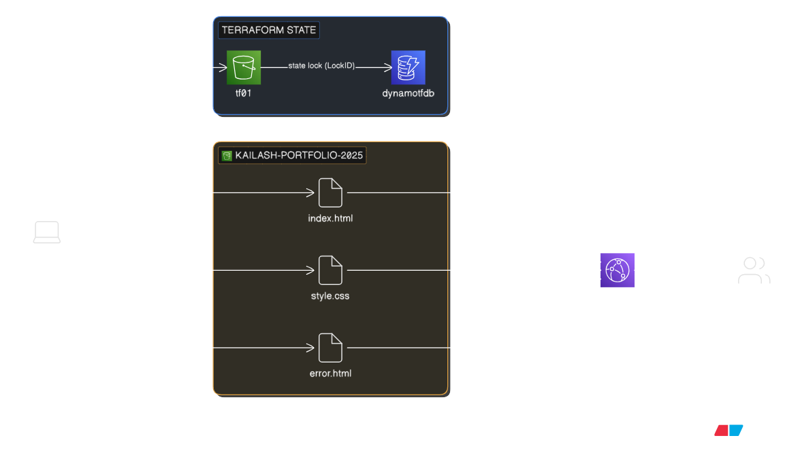

# Terraform — Static Site Hosting on S3
> Project: Portfolio/CV site hosted on AWS S3 | Full IaC with best practices

## Architecture



---

## Project Structure

```
static-site-terraform/
├── site/                        ← Your actual website files
│   ├── index.html               ← Home page
│   ├── style.css                ← Stylesheet
│   └── error.html               ← Custom 404 page
│
├── terraform/                   ← All Terraform code
│   ├── versions.tf              ← Terraform version, provider versions, remote backend
│   ├── provider.tf              ← AWS provider config
│   ├── variables.tf             ← Variable declarations with types and descriptions
│   ├── terraform.tfvars         ← Actual values for variables (edit before apply)
│   ├── locals.tf                ← Computed values: common tags, MIME types map
│   ├── main.tf                  ← All S3 resources
│   └── outputs.tf               ← Website URL and other outputs
│
└── .gitignore                   ← Excludes .terraform/, *.tfstate, etc.
```

### Why split into multiple files?

Terraform loads **all `.tf` files in a directory together** — splitting is purely for readability and maintainability, not a technical requirement. The convention is:

| File | Purpose |
|---|---|
| `versions.tf` | Terraform settings, provider pins, backend config — things that rarely change |
| `provider.tf` | Provider config — keeps authentication/region separate |
| `variables.tf` | All `variable` blocks — the "interface" of your config |
| `terraform.tfvars` | The actual values — easy to swap per environment |
| `locals.tf` | Derived/computed values used across files |
| `main.tf` | The actual resources — what gets built |
| `outputs.tf` | What to print after apply — URLs, IDs, ARNs |

---

## How S3 Static Website Hosting Works

```
Browser
  │
  │  HTTP GET http://<bucket>.s3-website-us-east-1.amazonaws.com/
  ▼
AWS S3 (Website Endpoint)
  │
  ├── Requested path = /  →  serves index.html
  ├── Requested path = /style.css  →  serves style.css
  └── Path not found  →  serves error.html
```

S3 has two types of endpoints:

| Endpoint Type | URL Format | Used For |
|---|---|---|
| **REST endpoint** | `s3.amazonaws.com/bucket/key` | API access, AWS CLI, SDK |
| **Website endpoint** | `bucket.s3-website-region.amazonaws.com` | Browser access, static sites |

For static sites you need the **website endpoint** — it supports `index.html` routing and custom error pages. The REST endpoint doesn't.

---

## Terraform Files — Deep Dive

---

### `versions.tf`

```hcl
terraform {
  required_version = ">= 1.6.0"

  required_providers {
    aws = {
      source  = "hashicorp/aws"
      version = "~> 5.0"
    }
  }

  backend "s3" {
    bucket         = "tf01"
    key            = "static-site/terraform.tfstate"
    region         = "us-east-1"
    dynamodb_table = "dynamotfdb"
    encrypt        = true
  }
}
```

**`required_version = ">= 1.6.0"`**
Ensures everyone using this config has at least Terraform 1.6. Prevents "works on my version" issues.

**`version = "~> 5.0"`**
Pins the AWS provider to 5.x. The `~>` operator means:
- `~> 5.0` = allow 5.0, 5.1, 5.2 ... but NOT 6.0
- `~> 5.31` = allow 5.31, 5.32 ... but NOT 5.32 → locked tighter

**`backend "s3"`**
Stores the state file at `s3://tf01/static-site/terraform.tfstate`. The `key` path `static-site/terraform.tfstate` creates a logical folder inside the shared `tf01` bucket — one bucket, many projects:

```
tf01/
├── ec2/terraform.tfstate           ← EC2 project
├── static-site/terraform.tfstate   ← This project
└── rds/terraform.tfstate           ← Future RDS project
```

---

### `variables.tf` + `terraform.tfvars`

```hcl
# variables.tf — DECLARATIONS (types, descriptions, optional defaults)
variable "bucket_name" {
  description = "Globally unique S3 bucket name"
  type        = string
}

# terraform.tfvars — ACTUAL VALUES
bucket_name = "kailash-portfolio-2025"
```

This separation means:
- `variables.tf` is the **contract** — what inputs this config accepts
- `terraform.tfvars` is the **data** — the actual values for this environment
- To deploy to a different environment, just swap `terraform.tfvars` — the code stays the same

**Why `bucket_name` has no default:**
S3 bucket names must be globally unique across all AWS accounts worldwide. There's no sensible default — you must choose your own unique name. If a bucket with that name already exists anywhere in AWS, creation will fail with a `BucketAlreadyExists` error.

---

### `locals.tf`

#### Common Tags

```hcl
locals {
  common_tags = {
    Project     = var.project_name
    Environment = var.environment
    ManagedBy   = "Terraform"
  }
}
```

Tags are key-value labels on AWS resources. Applied to every resource with `tags = local.common_tags`. Why they matter:

- **Billing** — Filter your AWS bill by project/environment
- **Auditing** — Who created this? Which project does it belong to?
- **Automation** — Scripts can target resources by tag

Instead of copy-pasting the same tags into every resource block, you define them once in locals and reference `local.common_tags` everywhere.

#### MIME Types Map

```hcl
mime_types = {
  "html" = "text/html"
  "css"  = "text/css"
  "js"   = "application/javascript"
  ...
}
```

When S3 serves a file, it sets the `Content-Type` HTTP header. If this is wrong (or missing), browsers misbehave:

| Content-Type | Browser Behavior |
|---|---|
| `text/html` | Renders as a webpage |
| `text/css` | Applies as a stylesheet  |
| `application/octet-stream` (wrong) | Downloads the file instead of rendering  |

Without the MIME map, S3 would serve your `style.css` as a binary download and your site would have no styles.

---

### `main.tf` — Resource by Resource

#### 1. `aws_s3_bucket`

```hcl
resource "aws_s3_bucket" "site" {
  bucket = var.bucket_name
  tags   = local.common_tags
}
```

Creates the S3 bucket. Deliberately minimal — in AWS provider v5+, all bucket settings (versioning, encryption, public access, website config) are **separate resources**, not arguments on this block. This is intentional — it makes each setting independently manageable.

---

#### 2. `aws_s3_bucket_public_access_block`

```hcl
resource "aws_s3_bucket_public_access_block" "site" {
  bucket                  = aws_s3_bucket.site.id
  block_public_acls       = false
  block_public_policy     = false
  ignore_public_acls      = false
  restrict_public_buckets = false
}
```

AWS S3 has a **"Block Public Access"** feature that blocks all public access by default — even if you add a public bucket policy. For a static website, you need to turn these off so visitors can read your files.

All four are set to `false` — full public access is allowed. The bucket policy below then restricts it to `s3:GetObject` only (read, not write).

> **Why not just use ACLs?** AWS deprecated ACLs for public access in 2023. Bucket policies are the modern, recommended approach.

---

#### 3. `aws_s3_bucket_website_configuration`

```hcl
resource "aws_s3_bucket_website_configuration" "site" {
  bucket = aws_s3_bucket.site.id

  index_document { suffix = "index.html" }
  error_document { key    = "error.html" }
}
```

Enables "Static website hosting" mode on the bucket. Without this, S3 won't serve `index.html` when you visit `/` — you'd get an XML error instead.

**`index_document`:** When a visitor hits `/` or any directory path, S3 looks for and serves `index.html`.

**`error_document`:** When a file isn't found (404) or another error occurs, S3 serves `error.html` instead of the default AWS XML error response.

---

#### 4. `aws_s3_bucket_policy`

```hcl
resource "aws_s3_bucket_policy" "site" {
  bucket     = aws_s3_bucket.site.id
  depends_on = [aws_s3_bucket_public_access_block.site]

  policy = jsonencode({
    Version = "2012-10-17"
    Statement = [{
      Sid       = "PublicReadGetObject"
      Effect    = "Allow"
      Principal = "*"
      Action    = "s3:GetObject"
      Resource  = "${aws_s3_bucket.site.arn}/*"
    }]
  })
}
```

**`depends_on`:** Terraform normally infers dependencies from references. But the bucket policy and the public access block don't reference each other — they both reference the bucket. Without `depends_on`, Terraform might try to apply the public policy while the block is still enabled, which AWS rejects. The explicit `depends_on` forces the correct order:
```
aws_s3_bucket  →  aws_s3_bucket_public_access_block  →  aws_s3_bucket_policy
```

**The policy statement:**
- `Principal = "*"` — anyone on the internet
- `Action = "s3:GetObject"` — can only read/download objects
- `Resource = "arn:...:bucket/*"` — applies to all objects in the bucket
- Visitors **cannot** `PutObject`, `DeleteObject`, or list the bucket — read-only

---

#### 5. `aws_s3_object` with `for_each` + `fileset`

```hcl
resource "aws_s3_object" "site_files" {
  for_each = fileset(var.site_dir, "**/*")

  bucket       = aws_s3_bucket.site.id
  key          = each.value
  source       = "${var.site_dir}/${each.value}"
  content_type = lookup(local.mime_types, reverse(split(".", each.value))[0], "application/octet-stream")
  etag         = filemd5("${var.site_dir}/${each.value}")
  tags         = local.common_tags
}
```

This single resource block uploads **every file** in the `site/` folder.

**`fileset(var.site_dir, "**/*")`**
Returns a set of all file paths relative to `site/`:
```
{
  "index.html",
  "style.css",
  "error.html"
}
```

**`for_each`**
Iterates over that set. For each file, Terraform creates one `aws_s3_object`. After apply, the state tracks:
```
aws_s3_object.site_files["index.html"]
aws_s3_object.site_files["style.css"]
aws_s3_object.site_files["error.html"]
```

**MIME type detection:**
```hcl
reverse(split(".", "style.css"))[0]
# split(".", "style.css")  →  ["style", "css"]
# reverse(...)             →  ["css", "style"]
# [0]                      →  "css"
# lookup(mime_types, "css", "application/octet-stream")  →  "text/css"
```

**`etag = filemd5(...)`**
Terraform computes the MD5 hash of each local file and compares it to the ETag on S3. It only re-uploads files that have actually changed. If you run `terraform apply` without touching the site files, Terraform says `No changes` — no unnecessary S3 API calls.

---

### `outputs.tf`

```hcl
output "website_url" {
  value = "http://${aws_s3_bucket_website_configuration.site.website_endpoint}"
}
```

After `terraform apply`, this prints the live URL of your site:
```
Outputs:

website_url = "http://kailash-portfolio-2025.s3-website-us-east-1.amazonaws.com"
```

Click that URL and your site is live.

---

## Step-by-Step: How to Deploy

### Prerequisites

- Terraform installed (`terraform -v`)
- AWS CLI installed and configured (`aws configure`)
- S3 backend bucket `tf01` and DynamoDB table `dynamotfdb` already created

### Step 1 — Edit your bucket name

```bash
# Open terraform/terraform.tfvars
# Change this line to your own unique bucket name:
bucket_name = "kailash-portfolio-2025"   # must be globally unique
```

### Step 2 — (Optional) Customize the site

Edit `site/index.html` and `site/style.css` with your own name, skills, and projects.

### Step 3 — Initialize Terraform

```bash
cd terraform/
terraform init
```

Terraform will:
- Download the AWS provider plugin
- Connect to the S3 backend
- Print: `Terraform has been successfully initialized!`

### Step 4 — Preview the changes

```bash
terraform plan
```

You'll see:
```
+ aws_s3_bucket.site will be created
+ aws_s3_bucket_public_access_block.site will be created
+ aws_s3_bucket_website_configuration.site will be created
+ aws_s3_bucket_policy.site will be created
+ aws_s3_object.site_files["index.html"] will be created
+ aws_s3_object.site_files["style.css"] will be created
+ aws_s3_object.site_files["error.html"] will be created

Plan: 7 to add, 0 to change, 0 to destroy.
```

### Step 5 — Apply

```bash
terraform apply --auto-approve
```

Output after apply:
```
Apply complete! Resources: 7 added, 0 changed, 0 destroyed.

Outputs:

bucket_name    = "kailash-portfolio-2025"
website_url    = "http://kailash-portfolio-2025.s3-website-us-east-1.amazonaws.com"
files_uploaded = ["error.html", "index.html", "style.css"]
```

### Step 6 — Visit your site

Open the `website_url` in a browser. Your portfolio is live.

---

## Updating the Site

To update site content (edit HTML/CSS) or add new files:

```bash
# 1. Make changes to files in site/
# 2. Run apply — Terraform detects changed files via MD5 and re-uploads only those
terraform apply --auto-approve
```

Terraform output will show:
```
~ aws_s3_object.site_files["index.html"] will be updated in-place
  ~ etag = "abc123" -> "def456"

Plan: 0 to add, 1 to change, 0 to destroy.
```

Only the changed file is re-uploaded — not the entire site.

---

## Destroying Everything

```bash
terraform destroy --auto-approve
```

This deletes:
- All uploaded S3 objects
- The bucket policy
- The website configuration
- The public access block
- The S3 bucket itself

The state backend (`tf01` bucket and `dynamotfdb` table) is **not** touched — those are managed by the bootstrap config.

---

## Common Errors & Fixes

| Error | Cause | Fix |
|---|---|---|
| `BucketAlreadyExists` | Bucket name taken by another AWS account | Change `bucket_name` in `terraform.tfvars` to something more unique |
| `BucketAlreadyOwnedByYou` | Bucket already exists in your account | Either import it or choose a new name |
| `AccessDenied` on bucket policy | Public access block still enabled | Add `depends_on = [aws_s3_bucket_public_access_block.site]` to the policy resource |
| Site loads but no styles | Wrong Content-Type for CSS | Check MIME type in `locals.tf` — `"css" = "text/css"` must be present |
| `terraform init` fails | Backend bucket `tf01` doesn't exist yet | Run the bootstrap config first to create `tf01` and `dynamotfdb` |
| 403 Forbidden on site URL | Bucket policy not applied or wrong | Run `terraform apply` again; check policy has `s3:GetObject` on `/*` |

---
